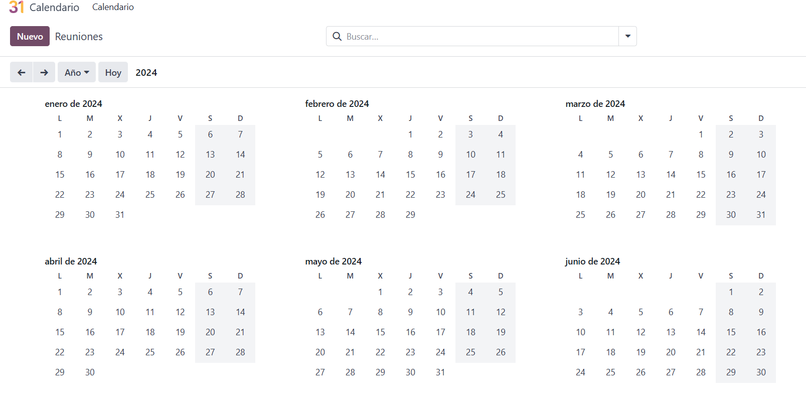
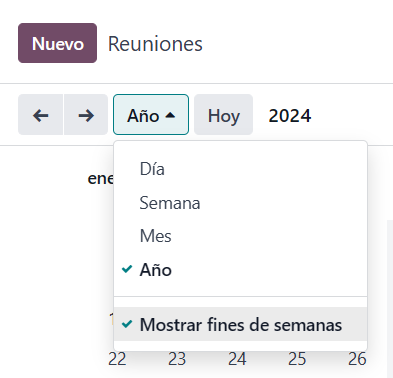
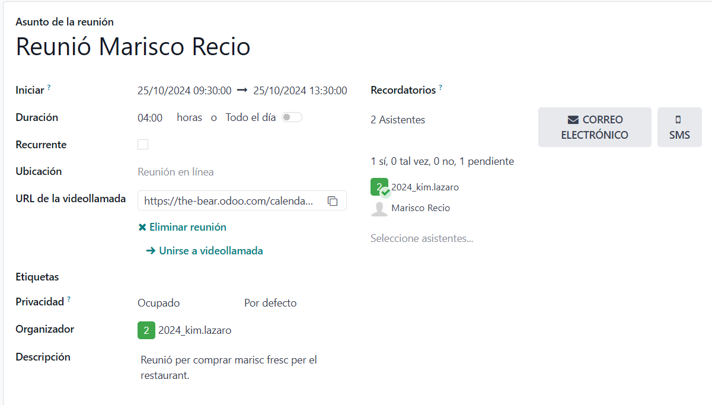
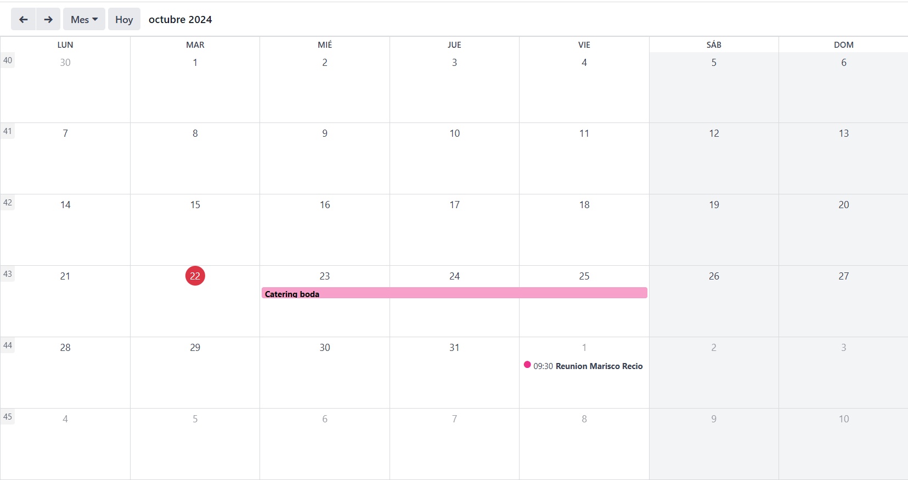

# Calendari
   
 
  
L'opció de calendari és semblant a una agenda, pots afegir dates indicades per a reunions/àpats de negoci, esdeveniments especials, dates importants.

També té una opció que ens permet visualitzar el calendari en el dia d'avui, en setmanes, en mesos o en anys. 
- Donant-li a la opció de "Nuevo" o fent clic dret sobre el calendari es pot afegir un esdeveniment i configurar-lo a conveniència.
 
Pots afegir:
- Assumpte de la reunió
- Data i hora d'inici, data i hora en què finalitza. Es pot programaruna reunió per unes hores, un dia, o un esdeveniment que pot durar fins i tot mesos.
- Pots posar si es repetirà i afegir-lo con algo permanent.
- Pots afegir la ubicació si és presencial, o inclús un URL de videotrucada si es farà online.
- També pots afegir els assistents.
- A més permet incloure una petita descripció i enviar un recordatori per SMS o correu electrònic
- Afegir on es farà

 