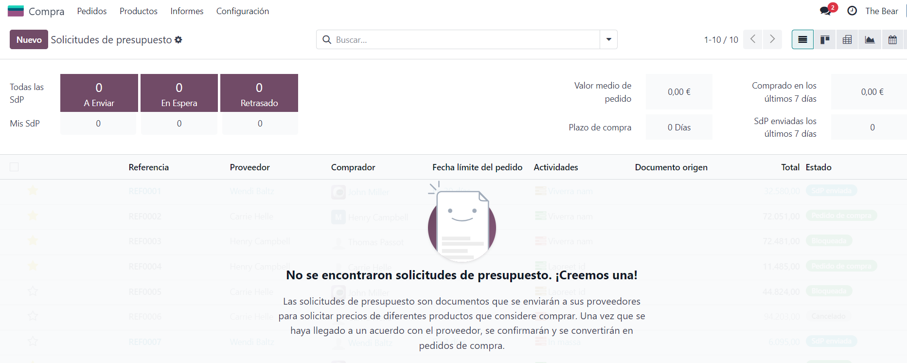

# Compres
    Una vegada instal·lada l'aplicació compra i accedim a ella podrem veure que està buida, ja que no hem creat cap pressupost. 
    Per crear un pressupost hem de fer una sol·licitud de pressupost al botó de l'esquerra superior.

    Dintre de la sol·licitud hem de proporcionar informació sobre el proveïdor, la referència de proveïdor, una data límit, si tenim una data de arribada prevista i quins productes esperem que arribin.

    Hi ha un subapartat que ens permet inserir més informació sobre qui compra el document d'origen, l'incoterm, la ubicació del incoterm les condicions de pagament i la posició fiscal.

    Una vegada confirmat la sol·licitud es pot veure totes les sol·licituds enviades i informació important d'aquestes.

</body>
</html>