# Módulo de Empleados

## Estructura de la documentación

## 1. Propósito del módulo

El módulo de empleados te permite administrar toda la información relacionada con el personal de tu empresa, incluyendo detalles sobre sus puestos de trabajo, informes de habilidades, información privada y la gestión de departamentos.

## 2. Instalación

1. **Acceder a la sección de aplicaciones**
Dirígete al apartado de aplicaciones en el panel central de **Odoo** y busca el módulo de **empleados**. Y haz clic al botón de instalar.

   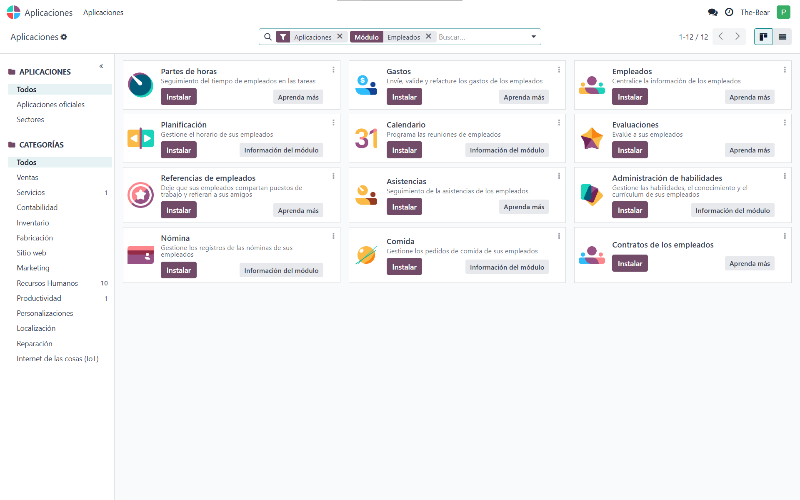

2. **Vuelve al Panel Central**
Ahora dirige al panel central y verás que la aplicación de **empleados** ya está instalada.

   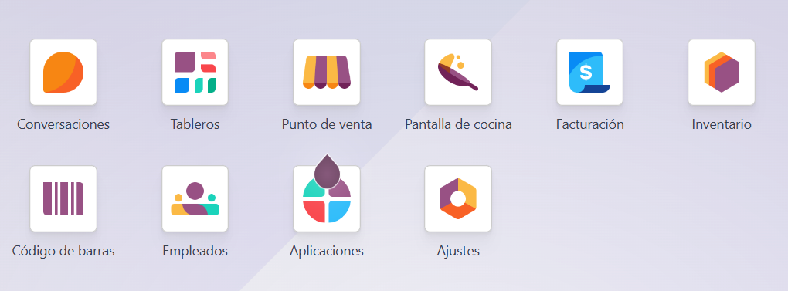

## Empleados

El panel de empleados permite gestionar a los empleados junto a toda su información y visualizarla.

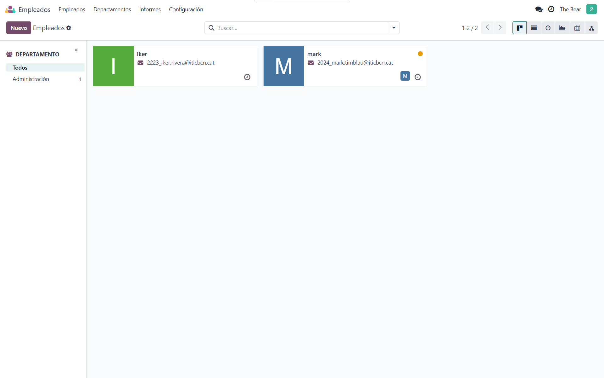

### Dar de alta a un empleado

Para dar de alta a un empleado tendrás que darle a "Nuevo" y rellenar los datos obligatorios.

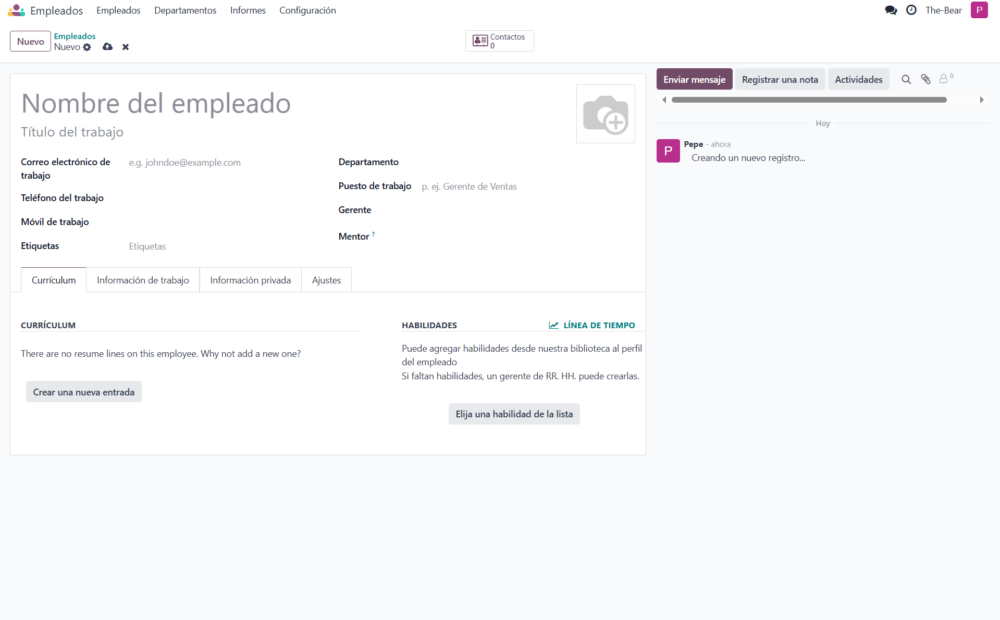

En este panel podrás gestionar a tu empleado y modificar su información, cada empleado consta de 3 apartados:

- Currículum.

- Datos personales.

- Información privada.

Aunque solo el nombre es obligatorio. Una vez hayas terminado de rellenar los datos puedes volver atrás dando al botón de Empleados.

## Departamentos

Si tu empresa tiene varios departamentos en esta sección podrás gestionarlos, además podrás asignar empleados en cada departamento y asignarles actividades, puestos de trabajo entre otros.

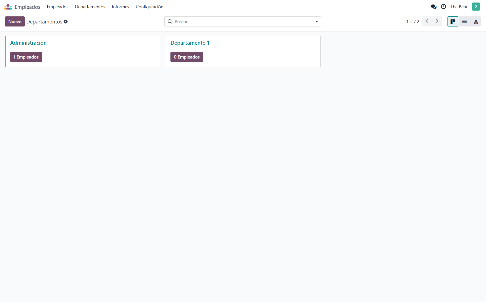

Para crear un departamento simplemente tendrás que darle a "Nuevo" y rellenar los datos.

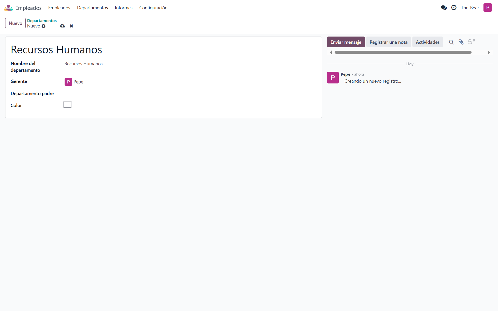

Por ejemplo, en este caso he creado un departamento de recursos humanos y le he asignado a Pepe como gerente.

### Añadir empleados

Para añadir empleados al departamento los podemos crear en el apartado de "Empleados" dentro del departamento.

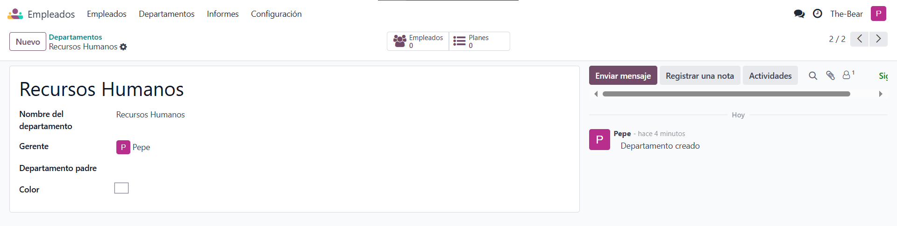

O podemos ir al módulo de Empleados y modificar a un empleado para no tener que crear uno.

### Actividades

Para añadir una actividad a un empleado tendrás que ir al apartado de empleados dentro del departamento donde pertenezca este mismo.

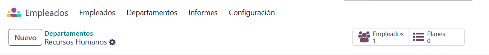

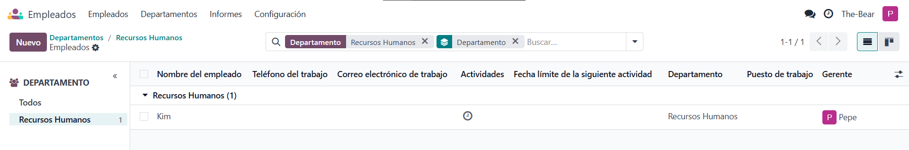

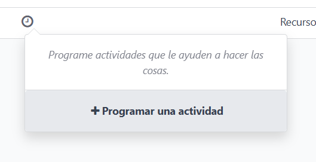

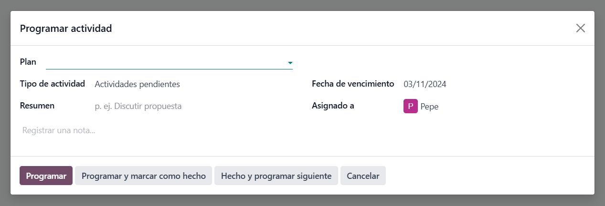

## Informes

Los informes permiten llevar un registro sobre las habilidades de cada empleado, esto puede ser útil para planificar mejor que empleado destinar a X tarea.

Para añadir las habilidades a un empleado tendremos que ir al panel de empleados, dar clic al cliente que queremos editar e ir al apartado de "Habilidades".

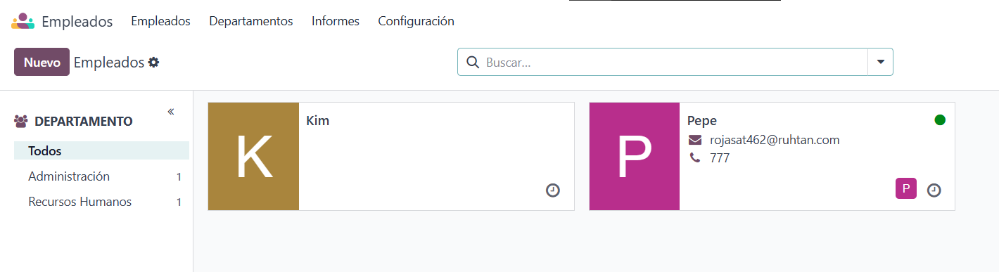

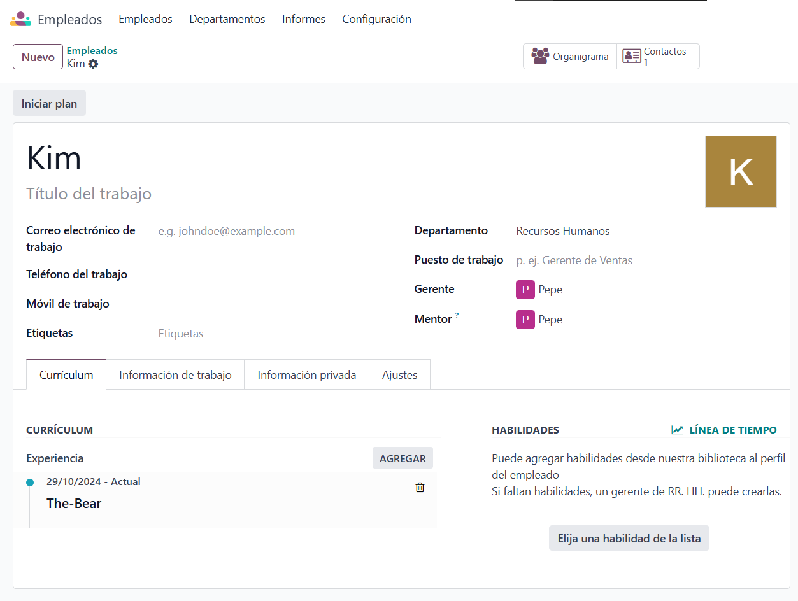

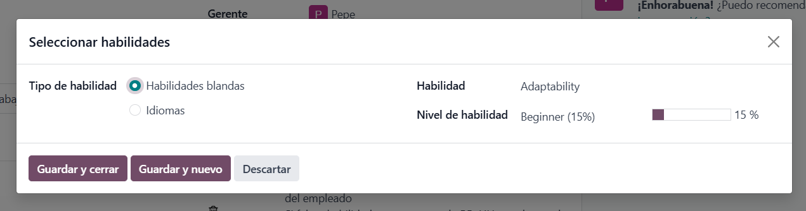

Puedes añadir/eliminar las habilidades en la configuración.