# Módulo de Eventos

## Estructura de la documentación

1. [Propósito del Módulo](#1-propósito-del-módulo)
2. [Instalación](#2-instalación)
3. [Panel Principal](#3-panel-principal)
   - [Creación de un nuevo evento](#31-creación-de-un-nuevo-evento)
   - [Organización por Etapas](#32-organización-por-etapas)
   - [Entradas](#33-entradas)
   - [Comunicación](#34-comunicación)
   - [Preguntas](#35-preguntas)
   - [Notas](#36-notas)
4. [Informes](#4-informes)

## 1. Propósito del módulo

El módulo de eventos permite administrar eventos, enviar correos automatizados a los asistentes y generar estadísticas sobre los eventos.

## 2. Instalación

Para instalar el módulo de eventos, sigue estos pasos:

1. **Acceder a la sección de aplicaciones**  
Dirígete al apartado de aplicaciones en el panel central de **Odoo** y busca el módulo de **eventos**. Y haz clic al botón de instalar.

   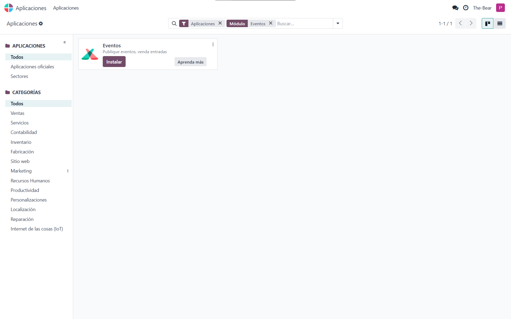

2. **Vuelve al Panel Central**
Ahora dirige al panel central y verás que la aplicación de **eventos** ya está instalada.

   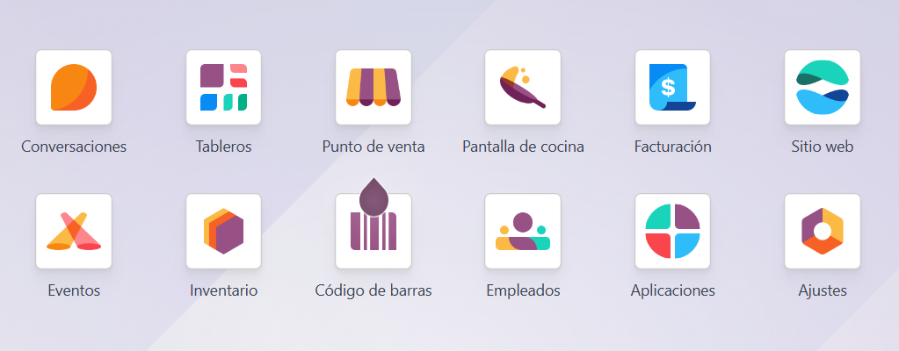

## 3. Panel principal

En el **panel principal** puedes ver y gestionar todos los eventos programados.

   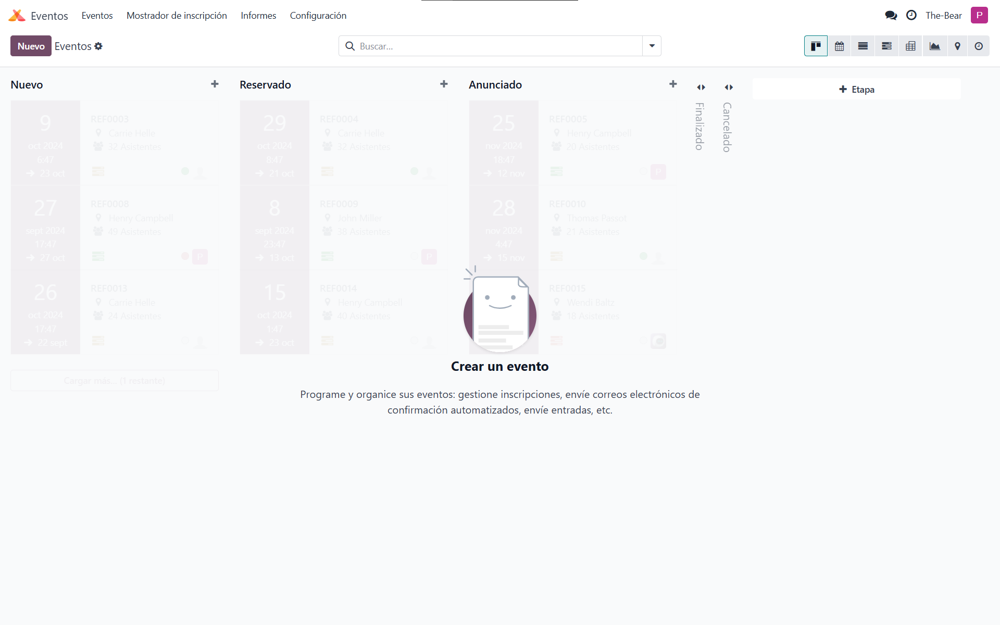

### 3.1 Creación de un nuevo evento

Para agregar un nuevo evento, haz clic en el botón **Nuevo** y completa los datos necesarios, como el nombre del evento, descripción, y detalles adicionales.

   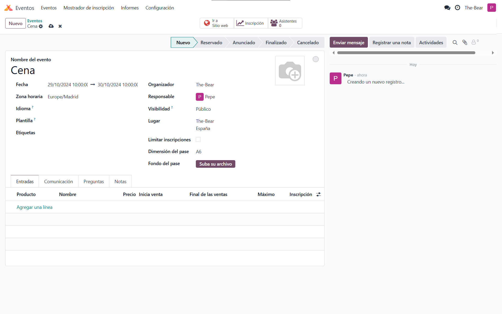

Una vez rellenados los datos, regresa al **panel principal** para visualizar tu evento creado.

   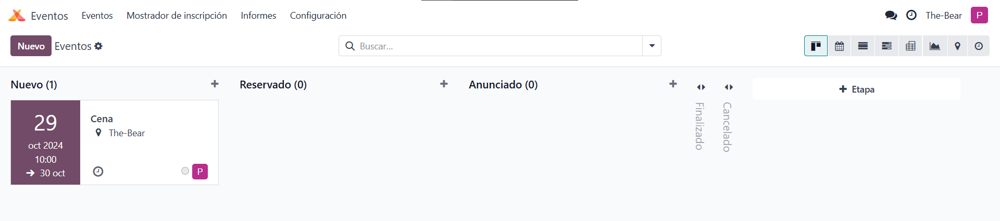

### 3.2 Organización por etapas

Los eventos se organizan por **Etapas**. Puedes asignar una etapa durante la configuración del evento, eligiendo entre las cinco etapas predeterminadas.

   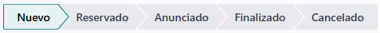

Si ninguna de las etapas predeterminadas se ajusta a tus necesidades, puedes crear una etapa nueva en el [panel principal](#3-panel-principal).

   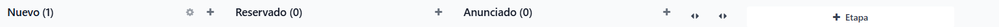

### 3.3 Entradas

En esta categoría, puedes configurar los detalles de las entradas, como nombre, fecha de disponibilidad, cantidad máxima y precio.

Para crear una nueva entrada, haz clic en **Agregar una línea** y completa los valores necesarios.

   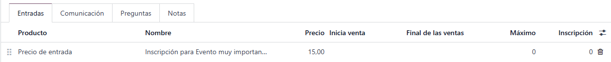

### 3.4 Comunicación

En esta categoría, puedes configurar mensajes automáticos para enviar a los compradores. Cada mensaje puede programarse para enviarse después de un evento específico, como la compra de una entrada.

Para agregar un mensaje, haz clic en **Agregar una línea** y elige una plantilla o crea una personalizada.

   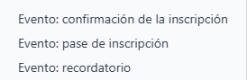

Para crear una plantilla tendrás que poner el nombre de tu desees y darle al **enter**, te saldrá el menú que ves en la foto, aquí podrás configurar el contenido que quieres enviar en el mensaje, el asunto, etc.
   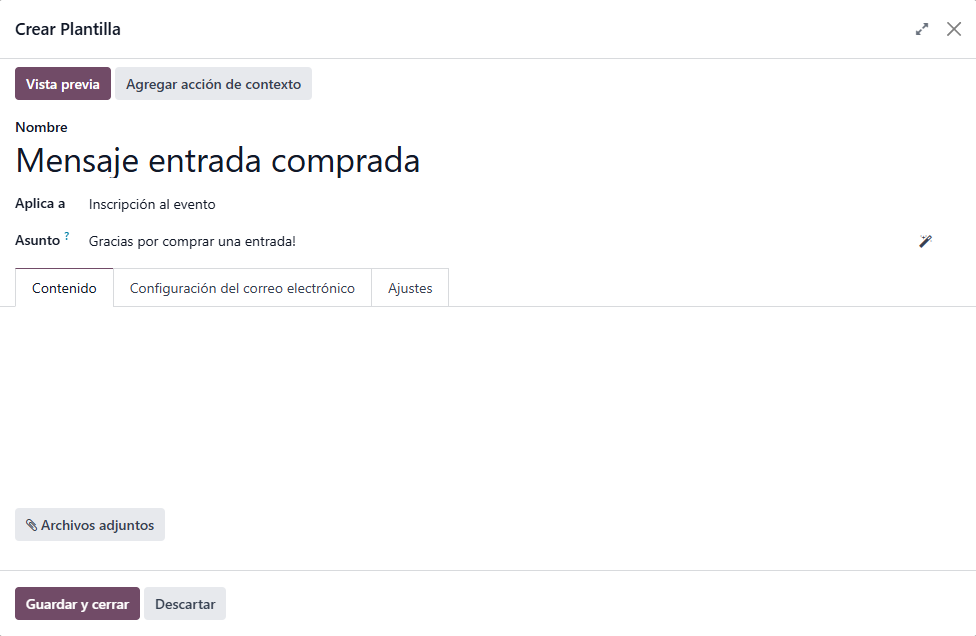

Una vez hayas terminado solo tendrás que configurar cuando quieres que se envíe el mensaje, el medio de comunicación (correo o SMS), cuando se envía, el intervalo, etc.
   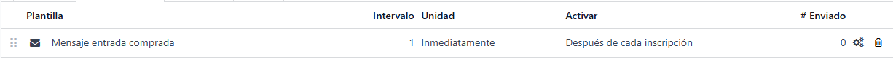

### 3.5 Preguntas

Aquí puedes configurar preguntas que se mostrarán a cada cliente al comprar una entrada.

   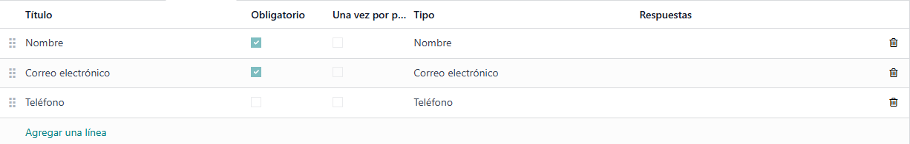

Para agregar una pregunta nueva simplemente tendrás que darle a **Agregar una línea**.

### 3.6 Notas

En esta categoría puedes añadir notas internas o información relevante para los clientes.

   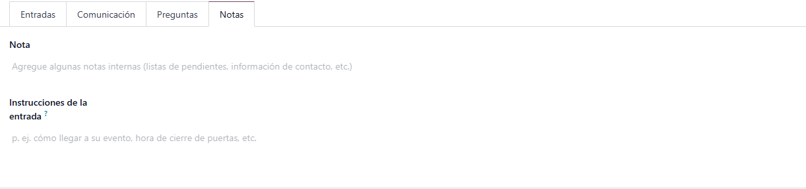

## 4. Informes

En la sección de **Informes**, puedes ver estadísticas sobre la asistencia a los eventos, lo que permite realizar análisis detallados y ver qué eventos triunfan más para poder sacar partido de ello.

   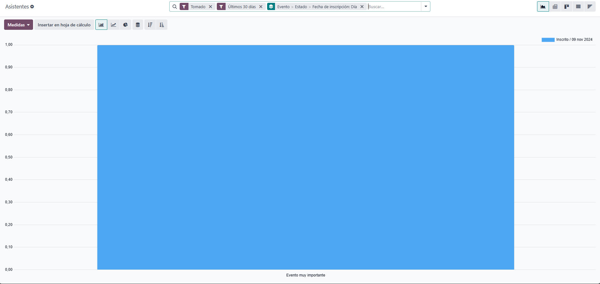