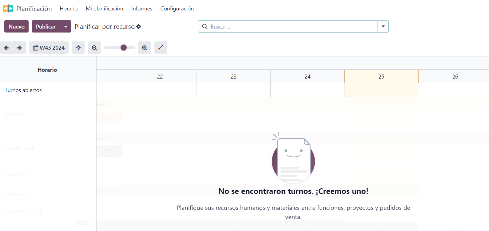
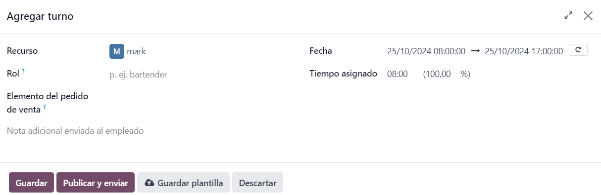
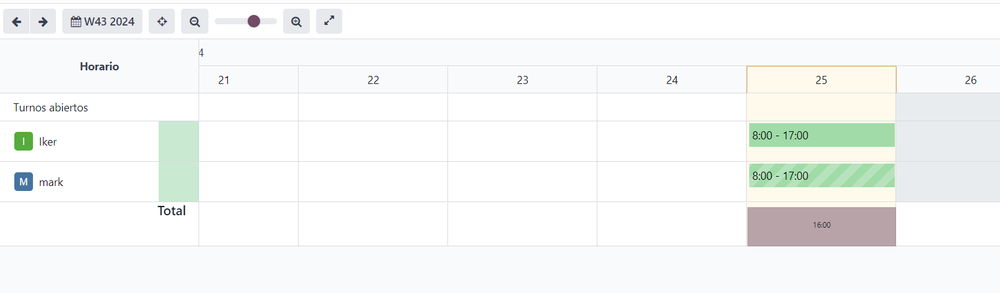

# Planificació
    Una vegada instal·lada l'aplicació compra i accedim a ella podrem veure que està buida, ja que no hem creat planificat res. 
    Per crear un pla hem de clicar al botó nou de l'esquerra superior.

    S'obrirà una pestanya on tindrem que afegir el recurs humà "la persona encarregada", el rol que farà, el temps en jornades i el temps total, amb la possibilitat de afegir un comentari.

    Si s'ha clicat el botó guardar simplement apareixerà al calendari d'horaris, però si publiquem i envien la persona que farà aquest horari rebrà un missatge per informar-lo.
