# Punts de venda
    Una vegada instal·lada l'aplicació punts de venda mostra possibles exemples de tipus de productes que pots vendre. En aquest cas direm que som una tenda de roba. 

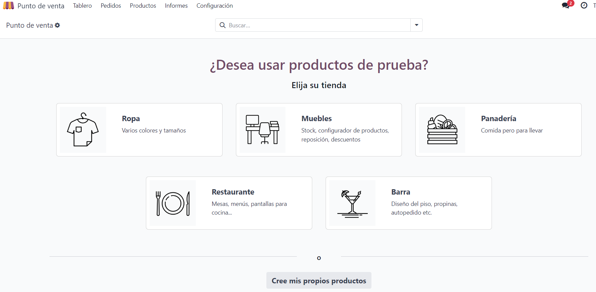

    Es crea l'apartat de tenda de roba i ens permet obrir la caixa registradora.

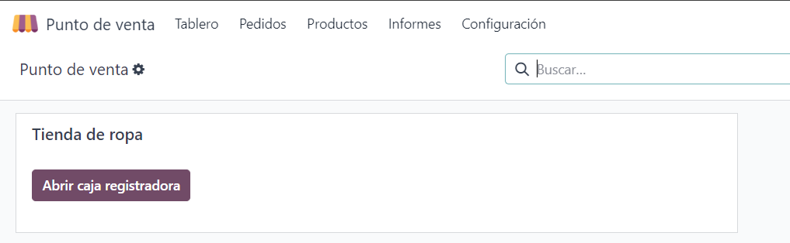

    Una vegada dintre podem delimitar la quantitat de diners amb els quals la caixa s'ha d'obrir cada dia.

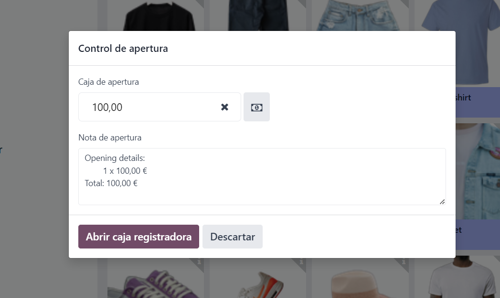

    La pàgina web ens proporciona unes quantes peces de roba d'exemple dividides en tres categories en la part superior de la pantalla.

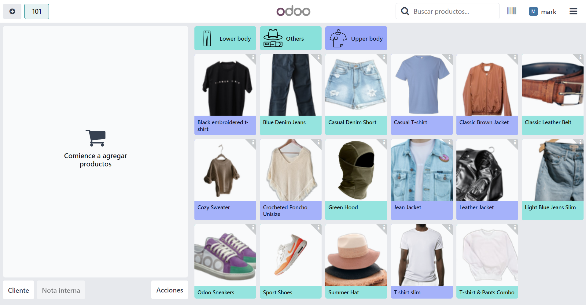

    Seleccionant la fletxeta a la cantonada superior a la dreta de cada peça ens permet visualitzar les nostres existències d'aquest producte i costos de venda d'aquest.

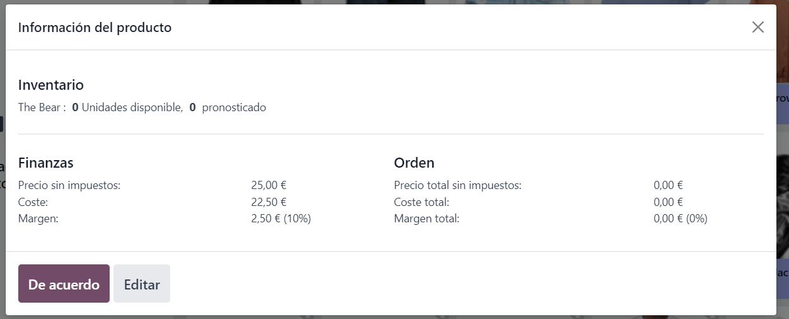

    Aquesta informació pot ser editada amb el botó editar.

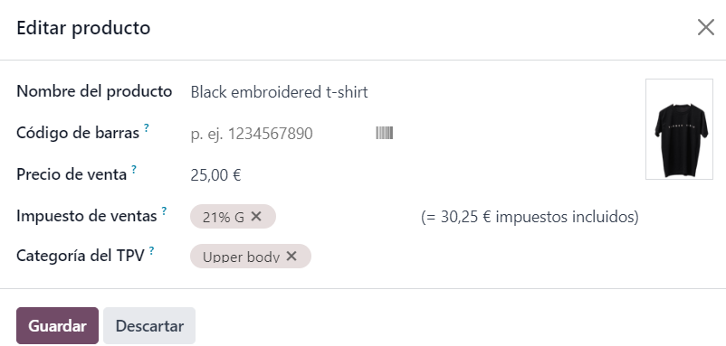

    Seleccionar una de les comandes en el centre de la imatge permet seleccionar la talla i si es vol efectuar un auto petit.

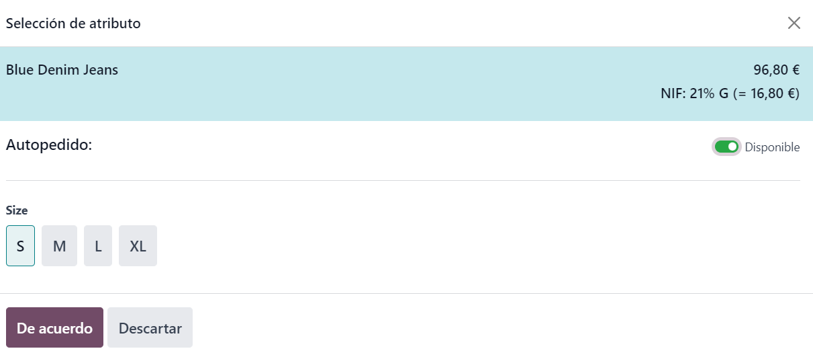

    A l'hora del pagament es pot visualitzar la llista de la compra i es poden editar els preus.

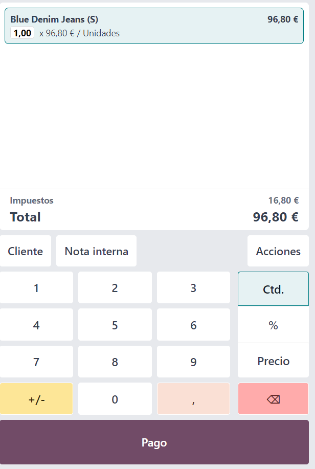

    Es pot inserir la informació del client per millorar el nostre coneixement de les preferències i necessitats d'aquests.

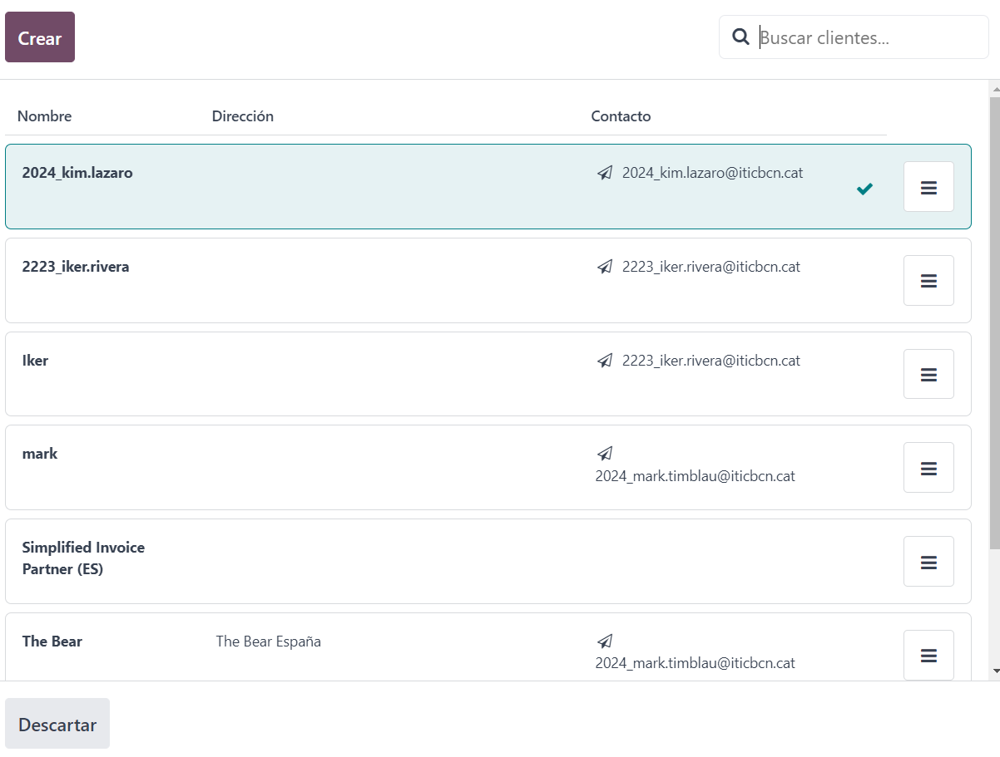
 
    També es pot inserir una nota interna per facilitar futures revisions.

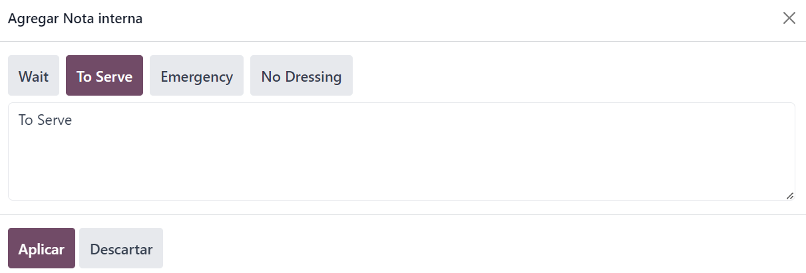

    Una vegada arribem al mètode de pagament podem seleccionar entre efectiu targeta i compta de client.

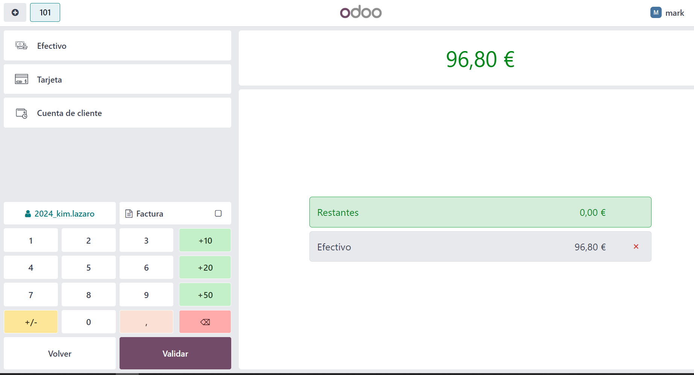

    Finalment, en validar la compra podem visualitzar un rebut, la possibilitat d'imprimir el rebut i la d'enviar per email el rebut de la compra.

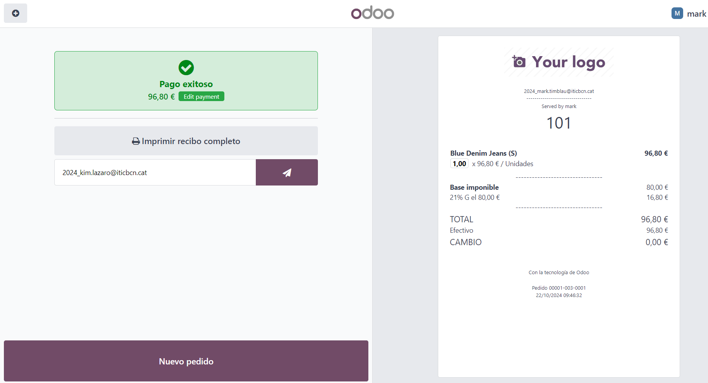