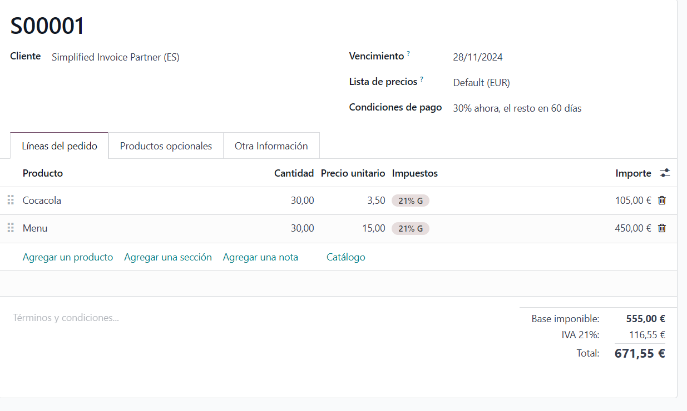
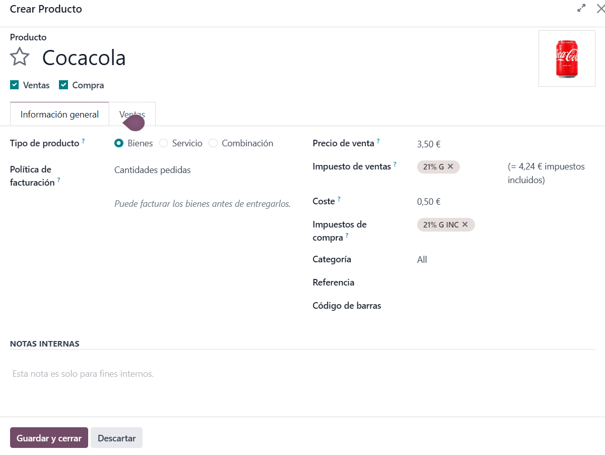
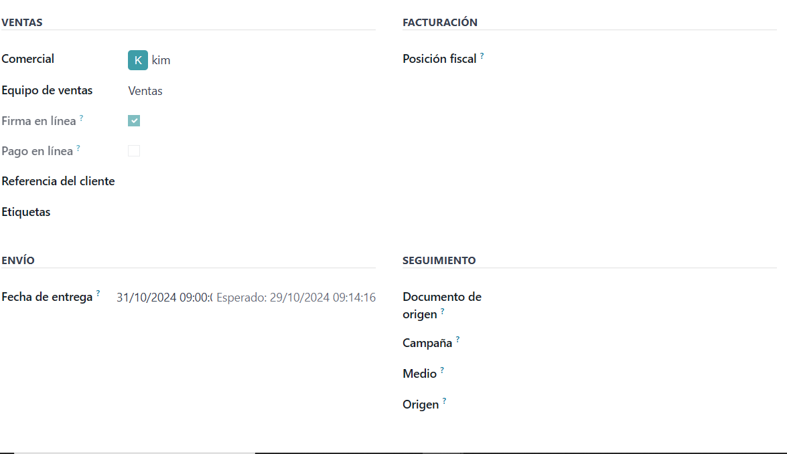
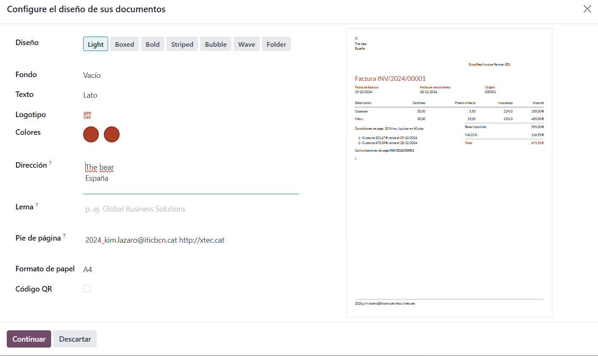

# Vendes

L'apartat de ventes serveix per crear ventes per a clients, fer factures adaptades a casa client i enviarles.
Fent clic a "nuevo" podem afegir una venta
 
Dintre de la venta afegirem el client al qui el vendrem, el preu, la quantitat i les condicions de pagament. El mateix programa ja li afegeix l'IVA.
També ens permet afegir productes opcionals.
 
Podrem afegir informació al crear un producte, la cual contindra el impost de la compra, el de la venta, el codi de barres i la politica de facturació.
ó
Si fem clic a "otra información" podem afegir com es farà el pago, la referència del client.
La data d'entrega, també podem canviar la posició fiscal, per adaptar els impostos al nostre client.
També podem afegir com ho enviarem i la campanya a la qual pertany la venda.
 
Un cop acabada la venda li permet imprimir i enviar, però abans la podem editar al nostre gust.