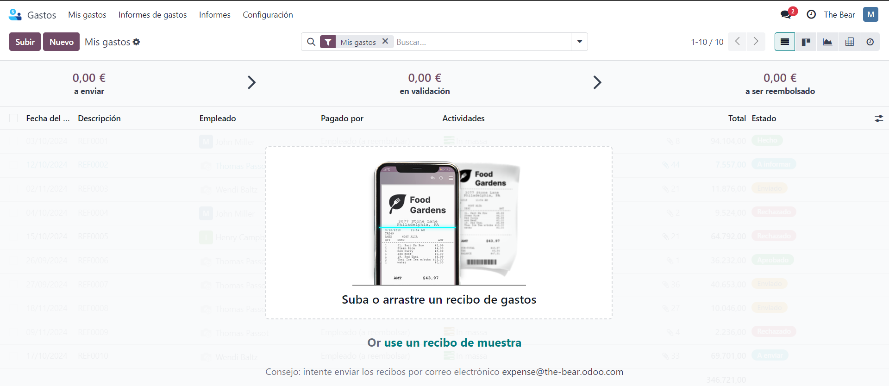
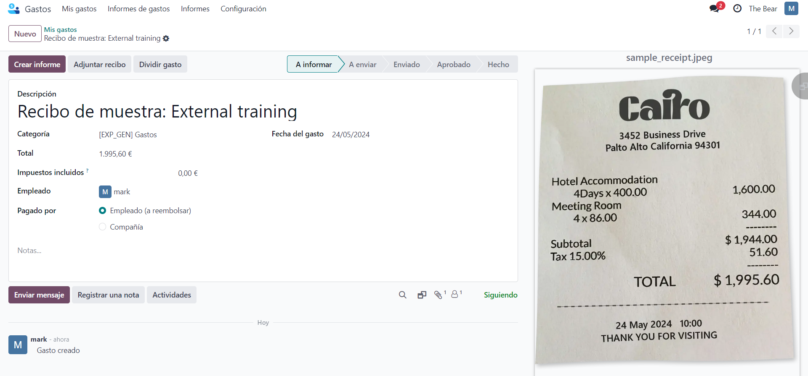
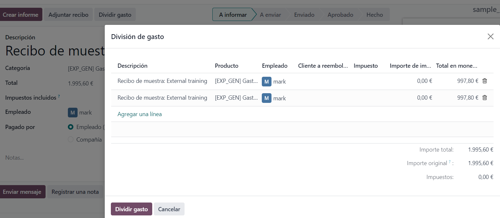
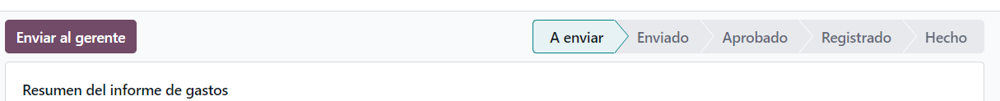
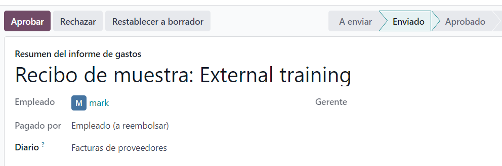
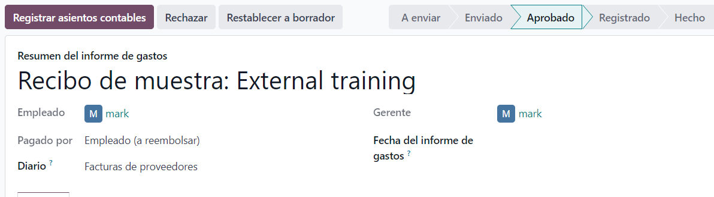
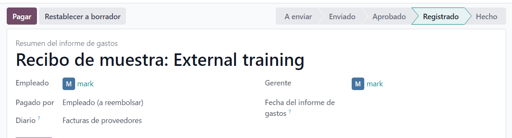
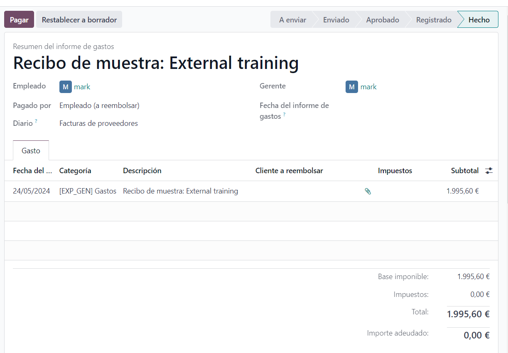

# Costos
    Una vegada instal·lat l'aplicació costos accedim a ella i podrem veure que està buida.

    Amb aquest exemple es pot veure informació com el nom, categoria, expenses, impostos, qui ho ha pagat i la data del rebut.

    També és possible dividir les despeses entre els empleats.

    Una vegada creat l'informe s'ha d'enviar al gerent.

    I el gerent ho té que aprovar.

    Després s'ha de registrar el comptable.

    I després de tot això es pot confirmar el pagament.

    Una vegada pagat es pot veure la llista de pagaments dintre d'aquest rebut.

</body>
</html>